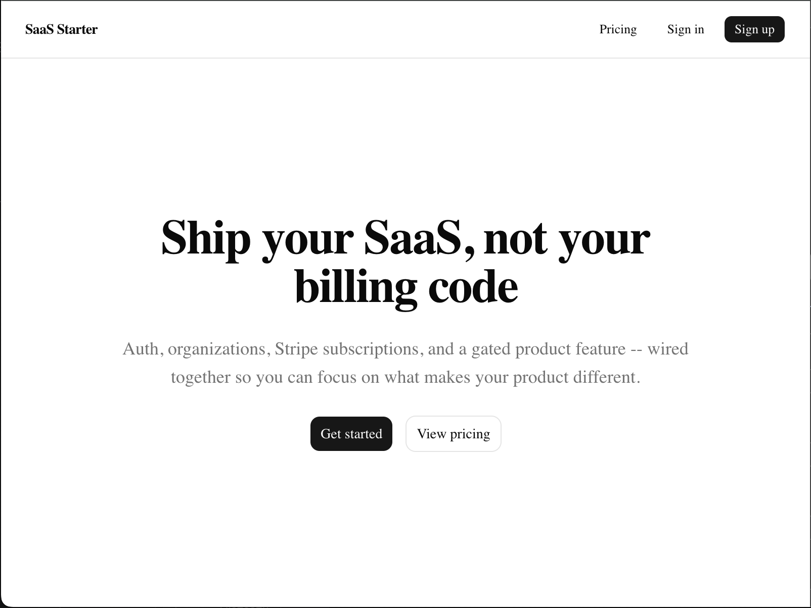
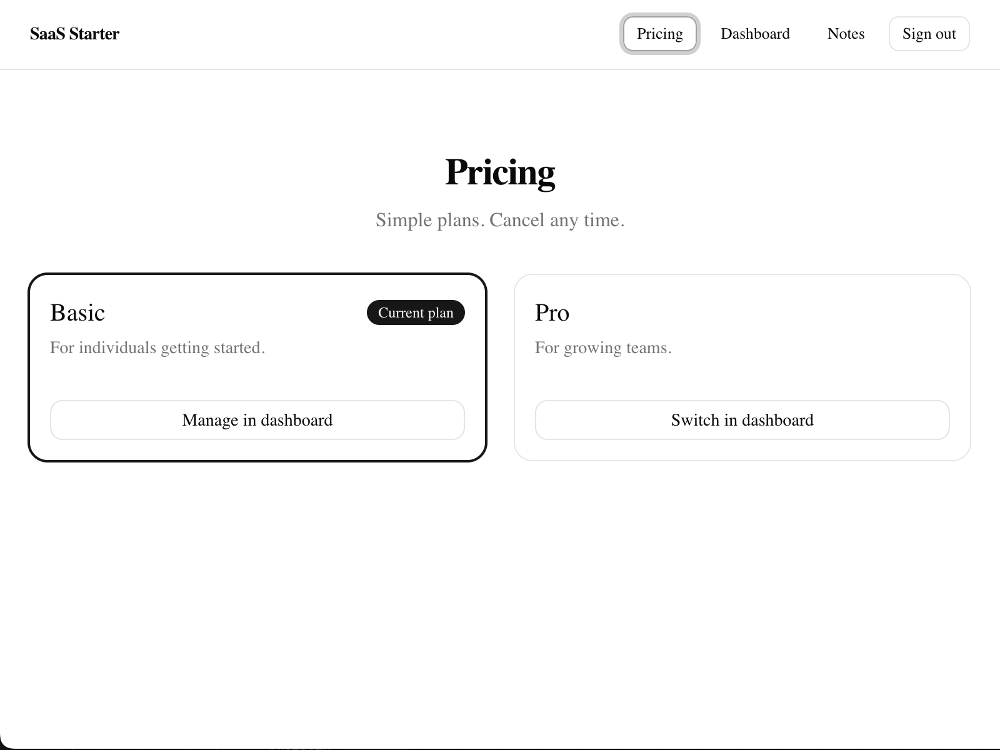
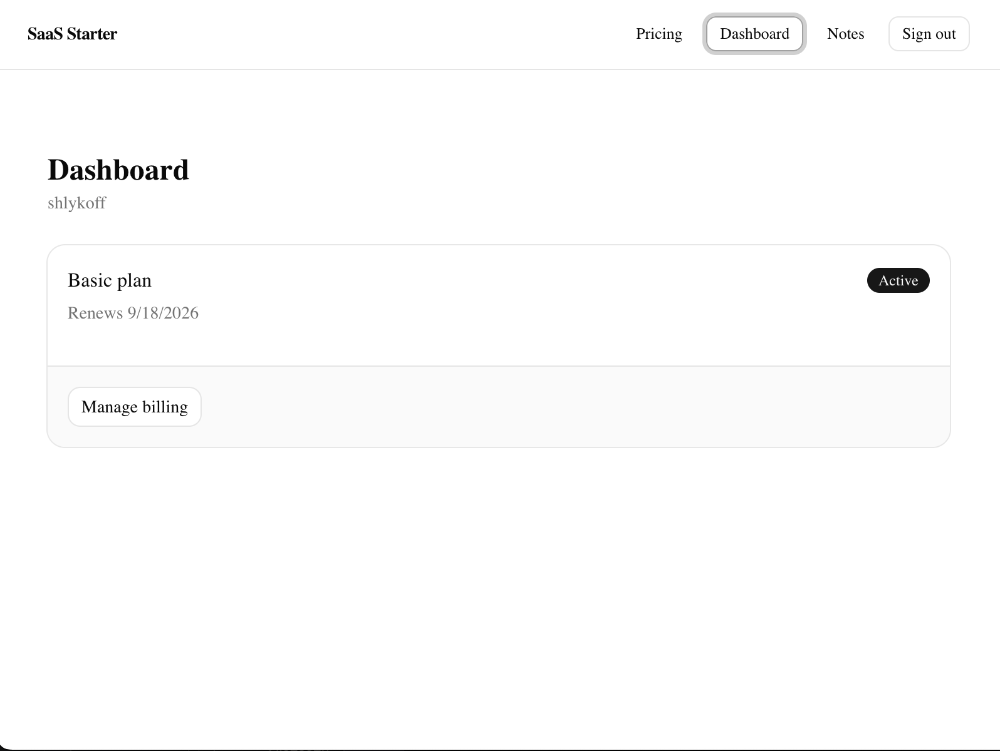
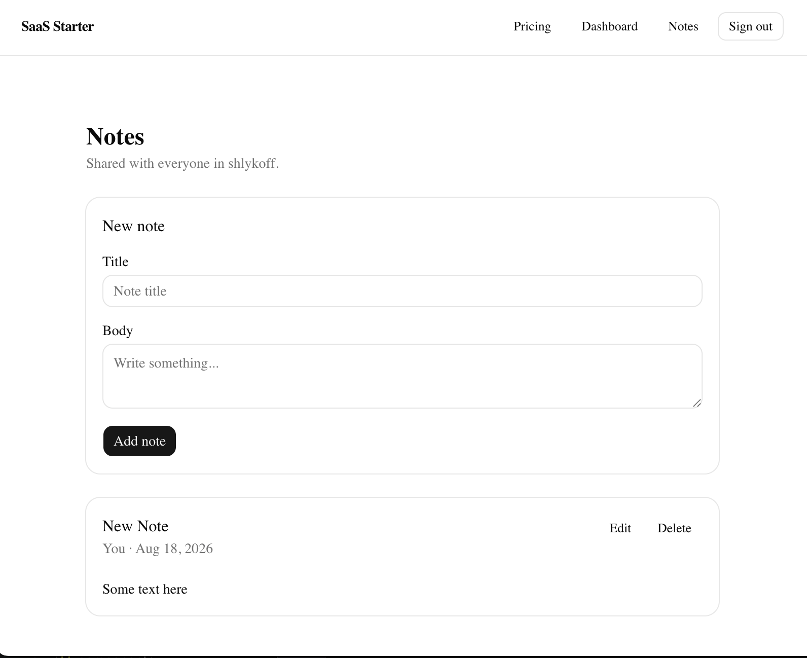
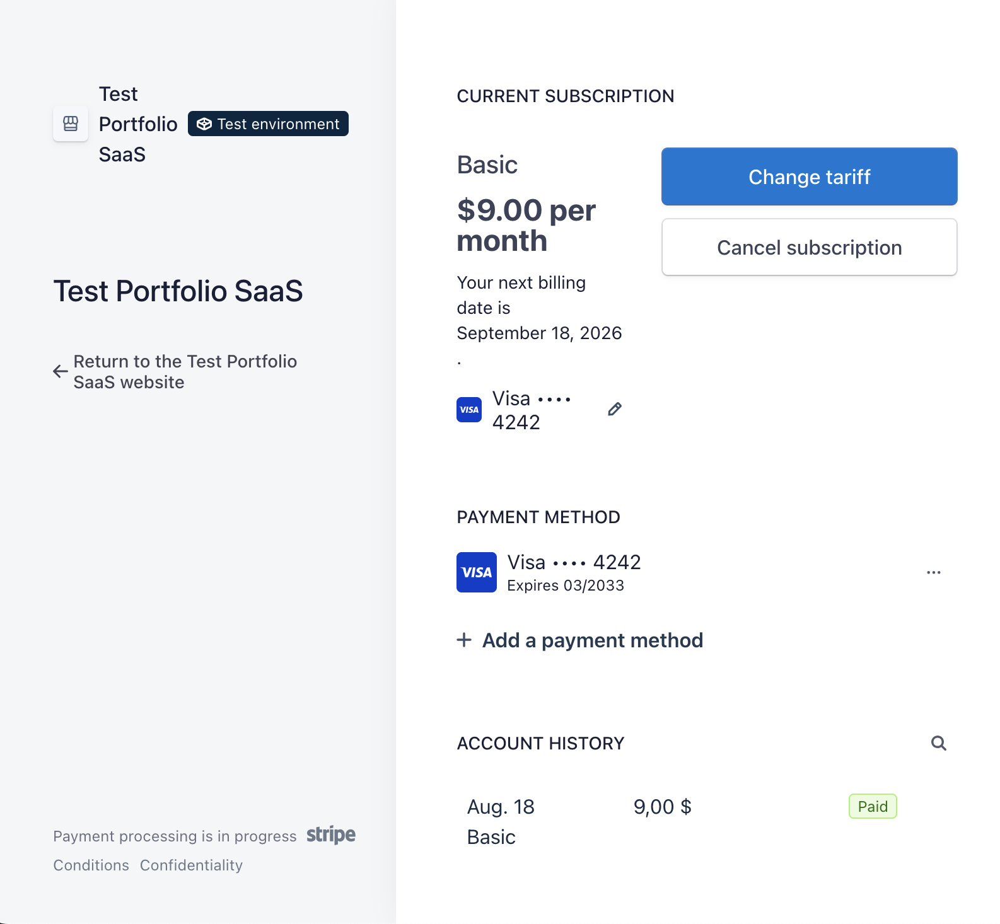

# SaaS Starter

**English** | [Русский](README.ru.md)

[](https://github.com/Shlykoff/saas-next-stripe-starter/actions/workflows/ci.yml)

**Live demo:** https://saas.shlykoff.com — test accounts and cards are listed in the sections below ("Running locally" for seeded accounts, "Test cards" for Stripe).

A subscription SaaS starter: Next.js (App Router) + Supabase (Auth/Postgres/RLS) + Stripe (Checkout, Customer Portal, Webhooks). Full spec — `docs/spec.md`; agent context — `CLAUDE.md`.

> Status: the MVP flow is fully built, deployed to production (Vercel + hosted Supabase + Stripe test mode + Resend), and manually walked through end-to-end in a real browser — signup with mandatory email confirmation (real delivery via Resend), Google OAuth sign-in, onboarding (workspace creation), pricing → Stripe Checkout, a Basic→Pro upgrade directly in the Stripe Customer Portal with an immediate prorated charge, a dashboard showing plan name/status, and the gated product feature `/notes` (real CRUD with organization-scoped RLS) behind subscription status.

## Screenshots

| Landing | Pricing | Dashboard |
|---|---|---|
|  |  |  |

| Notes (gated feature) | Stripe Customer Portal |
|---|---|
|  |  |

## Stack

Next.js 16 (App Router, Server Actions, Server Components) · Supabase (Auth + Postgres + RLS) · Stripe (Checkout, Customer Portal, Webhooks) · Tailwind v4 + shadcn/ui (base-ui) · TypeScript strict.

## Features

- **Sign up / sign in** (`/signup`, `/login`) — email+password via Server Actions (`app/actions/auth.ts`) plus a "Continue with Google" button (OAuth, PKCE flow through `/auth/callback`). Server-side email/password validation, clear error messages (wrong password, already registered, email not confirmed). **Email confirmation is mandatory** (`auth.email.enable_confirmations = true` in `supabase/config.toml`): after `/signup`, sign-in is blocked until the user clicks the link in the confirmation email. The link points at the app's own `/auth/confirm` route (`app/auth/confirm/route.ts`, custom template `supabase/templates/confirmation.html`) instead of Supabase's built-in `.../auth/v1/verify` — needed for compatibility with the PKCE flow the rest of the app uses (same explicit cookie-write-on-response pattern as `/auth/callback`).
- **Onboarding** (`/onboarding`) — a form to create an organization (name/slug); a DB trigger makes the creator the owner automatically. Redirects to `/dashboard` if an organization already exists.
- **Pricing** (`/pricing`) — 2 plans (Basic/Pro) from `lib/plans.ts`, a Subscribe button → `createCheckoutSession` → Stripe Checkout. Shows the current plan instead of the button once a subscription is active; the button is hidden for non-owners (the real enforcement is at the server-action level — see `requireOrgOwner` in `app/actions/billing.ts`).
- **Dashboard** (`/dashboard`) — current plan name and status (`lib/plans.ts`'s `planForPriceId`, a reverse lookup on `subscriptions.stripe_price_id`), renewal date, and a "Manage billing" button → Stripe Customer Portal. A banner prompts to subscribe / update payment method when there's no subscription or a payment failed.
- **Notes** (`/notes`, gated) — access only when `subscriptions.status in ('active', 'trialing')`, checked server-side in `app/notes/page.tsx` via `lib/subscription-access.ts` plus an RLS-protected query against `subscriptions` (not just hiding a button — an organization without a subscription never receives the content markup at all). Behind the gate is real CRUD over the `notes` table (`supabase/migrations/20260817212642_add_notes.sql`): notes are shared across the organization, any member can create/edit, but editing/deleting someone else's note is owner-only (enforced by an RLS policy, not application code — see `app/actions/notes.ts`). The list is server-paginated (20/page, `?page=`), searchable (`?q=`, case-insensitive `ilike` over title/body, debounced client-side before it touches the URL), and sortable (`?sort=newest|oldest|title_asc`) — all three live in `lib/notes.ts`'s `getOrganizationNotes` and are driven entirely by the URL, read server-side by `app/notes/page.tsx` (`components/notes/notes-toolbar.tsx`, `components/notes/notes-pagination.tsx`). Changes made by a teammate (or the same user in another tab) show up live via `components/notes/notes-realtime.tsx`, a **private** Supabase Realtime broadcast channel (`notes:org:<organization_id>`) rather than the default `postgres_changes` — `postgres_changes` does not check RLS for `DELETE` events (a documented Postgres/Realtime limitation: there's no row left to evaluate a policy against once it's gone), so a naive client-side `filter: organization_id=eq.<id>` would leak every organization's note deletions to every subscriber. Instead, a DB trigger (`trg_notes_broadcast_changes`) publishes INSERT/UPDATE/DELETE to that private topic, and a real RLS policy on `realtime.messages` (`notes_broadcast_authorized_org_members`, `supabase/migrations/20260818174917_enable_notes_realtime.sql`) authorizes delivery per-subscriber against their own JWT — verified against a real WebSocket connection and two real organizations in `tests/notes-realtime.test.ts`, not just trusted from the migration's comment.
- **Org switcher** — a user can belong to more than one organization (`organization_members` has no per-user uniqueness constraint). Which one is "active" lives in an `active_org_id` cookie rather than the URL (routes stay flat — no `/org/[slug]/...` refactor), resolved by `lib/org.ts`'s `getActiveOrganization` (cookie → RLS-checked membership → falls back to the first organization by `created_at` and repairs the cookie). The switcher in the header (`components/layout/org-switcher.tsx`) only renders as a dropdown when there's more than one organization to choose from; with exactly one, it's just a label. Switching goes through the `switchOrganization` Server Action (`app/actions/org.ts`), which re-verifies membership server-side before ever trusting a client-supplied organization id.
- **Team members & email invites** (`/dashboard/members`) — the organization owner invites teammates by email + role (owner/member); the invite is emailed via [Resend](https://resend.com) (`lib/resend.ts`, `lib/emails/invite-email.ts`) with a link to `/invite/accept?token=...`. The invitee signs in or signs up (existing `next=` redirect pattern) and accepts; acceptance runs through `service_role` (`app/actions/invites.ts`'s `acceptInvite`) because RLS deliberately gives an ordinary session no path to self-accept (`organization_invites_update_owner_revoke` only permits `pending → revoked`, and `organization_members` INSERT is owner-only) — so `acceptInvite` re-verifies email match, `pending` status, and expiry itself rather than trusting the page's own (UX-only) checks. Members/invites data: creating/revoking an invite goes through the session-bound client (RLS-enforced, owner-only); the member roster's emails come from a read-only `service_role` lookup (`auth.admin.getUserById`) scoped to ids an RLS-scoped query already proved belong to the organization, since `organization_members` has no email column and `auth.users` isn't queryable by the anon-key client. Because an invite can be accepted from an entirely different tab/browser/session than the one an owner is looking at this page in, `/dashboard/members` re-fetches on tab focus (`components/refresh-on-focus.tsx`, a `visibilitychange`/`focus` listener calling `router.refresh()`, throttled to at most once per 3s) rather than staying stale until a manual reload — deliberately not Supabase Realtime here: an owner catching up on invite state when they switch back to this tab doesn't need the same second-by-second live feed `/notes` has (see the Notes bullet above), so the simpler focus-triggered refresh is the right amount of machinery for this page. The owner can also remove a member outright or change their role directly (an inline `<Select>` next to each teammate's row, `changeMemberRole` in `app/actions/org.ts`) — both are one RLS-authorized action away (`organization_members_delete_owner_or_self` / `organization_members_update_owner`), never shown for the owner's own row (removing/demoting the sole owner is still safely rejected server-side by `trg_prevent_last_owner_change` even though the UI never offers it), and both send the affected member a best-effort notification email (`lib/emails/member-removed-email.ts` / `role-changed-email.ts`) — a failed send never rolls back the actual change.
- **Routes are protected** both at the `proxy.ts` level (Next.js 16 renamed `middleware.ts` to `proxy.ts`; redirects to `/login` before render) and again at every server component page (a real check, not just UX convenience).

## Running locally (full flow)

```bash
npm install
supabase start          # spins up local Supabase in Docker
cp .env.example .env.local
# fill in .env.local with values from `supabase status` + Stripe test keys (see below)
npm run dev
```

**Keep `stripe listen --forward-to localhost:3000/api/webhooks/stripe` running in a separate terminal for the whole local dev session** (not just during one test) — without it, Stripe physically cannot deliver a webhook to `localhost`, and `checkout.session.completed`/`customer.subscription.*` events are simply lost: Checkout succeeds, but `/dashboard` stays on "No active subscription" as if the payment failed. If you forgot and already missed an event, there's no need to redo Checkout — the event already happened in Stripe: `stripe events list --limit 5` finds its `evt_...`, and `stripe events resend <event_id> --confirm` redelivers it once `stripe listen` is running again.

> Known environment quirk: if `npm run dev` loops on `Watchpack Error (watcher): EMFILE: too many open files`, that's a file-descriptor limit of the particular sandbox/machine, not a project bug — `npm run build && npm run start` (no persistent watcher) isn't affected and works fine for an end-to-end check.

**Use the same host everywhere: either `127.0.0.1` or `localhost` — never mix them.** Browsers treat `localhost` and `127.0.0.1` as different hosts for cookie purposes, even though both point at the same server. If you sign in via `http://127.0.0.1:3000` while `NEXT_PUBLIC_APP_URL` in `.env.local` is set to `http://localhost:3000`, Stripe will redirect you back to a host that never received your session cookie post-Checkout, and `/dashboard` will show "not signed in" even though the payment succeeded. Same logic for Google OAuth and the email confirmation link: the `redirectTo`/emailed link the browser actually uses must be in `additional_redirect_urls` in `supabase/config.toml` — if only `site_url` (the bare origin) is listed, without the `/auth/callback` or `/auth/confirm` path, GoTrue silently falls back to `site_url`, and the auth code never gets exchanged for a session. `.env.example` and `supabase/config.toml` in this repo are already aligned on `127.0.0.1` — if you change one, update the other.

Walking the full flow by hand:

1. Open `http://localhost:3000`, click "Get started" → `/signup`, register with email+password. A session is **not** created immediately — the form shows "Account created. Check your email to confirm your address before signing in." Open Mailpit (a local SMTP catcher — no real email is sent) at `http://127.0.0.1:54324`, find the "Confirm your email" message, and follow the link — it lands on `/auth/confirm` and signs you in. Trying to sign in before confirming returns a clear "Email not confirmed" error.
2. Onboarding: enter a workspace name/slug → redirect to `/dashboard`.
3. `/dashboard` shows a "No active subscription" banner → go to `/pricing`.
4. Click "Subscribe" on either plan → Stripe Checkout (test mode) → pay with the test card `4242 4242 4242 4242` (see "Test cards" below).
5. Redirect back to `/dashboard?checkout=success`. Subscription status updates asynchronously via the webhook — this requires either `stripe listen --forward-to localhost:3000/api/webhooks/stripe` running beforehand (see below), or a manual `stripe trigger checkout.session.completed`.
6. Once the subscription status is `active`/`trialing`, `/notes` shows the real note list instead of the paywall: you can create a note, edit/delete your own; the organization owner can edit/delete any note in the organization (moderation), a regular member only their own.

Alternatively, skip Checkout entirely and use the seeded test accounts from `supabase/seed.sql` (loaded automatically by `supabase db reset`) — password for all of them: `password123`. These accounts are inserted directly into `auth.users` with `email_confirmed_at` already set, so email confirmation isn't required and sign-in works immediately:

| Email | Organization | Role | Subscription |
|---|---|---|---|
| `owner_a@example.com` | Acme | owner | `active` — `/notes` unlocked |
| `member_a@example.com` | Acme | member | `active` — `/notes` unlocked, billing hidden (not owner) |
| `owner_b@example.com` | Globex | owner | no subscription — `/notes` shows the paywall |

Tests: `npm run test` (Vitest). Requires a running local Supabase (`supabase start`) — the integration tests (webhook, `/notes` subscription gating, `notes` CRUD authorization, `notes` pagination/search/sort, and the `notes:org:<id>` Realtime broadcast channel's RLS authorization over a real WebSocket in `tests/notes-realtime.test.ts`) read/write real tables in the local database and use the seed accounts from the table above.

If you changed the DB schema (a new migration), regenerate the TS types, or `lib/supabase/database.types.ts` silently drifts out of sync with the schema:

```bash
npm run db:types   # supabase gen types typescript --local > lib/supabase/database.types.ts
```

### Checking something against production from the shell

`.env.local` always points at local Docker Supabase — that's what `npm run dev`/`npm run test` read, and it should never be edited to temporarily hold production credentials just to run one `curl`/`supabase` command against the hosted project. Instead, keep a separate `.env.production.local` (gitignored, same variable set, real hosted Supabase URL/keys + `NEXT_PUBLIC_APP_URL=https://saas.shlykoff.com`) and load it into just the current shell on demand:

```bash
source scripts/env.sh production   # this shell only, until you close it
# ... curl/supabase commands now see the real hosted project ...
source scripts/env.sh local        # back to local Docker Supabase
```

Neither `.env.local` nor `npm run dev` are ever touched by this — it's purely for one-off verification (checking RLS on the hosted project, inspecting a real webhook delivery, etc.), not a second app environment to develop against.

## Google OAuth

The "Continue with Google" button (`components/auth/google-oauth-button.tsx`) calls `supabase.auth.signInWithOAuth({ provider: "google" })` and has been verified live end-to-end with a real Google account. Without real Google OAuth credentials in the environment where `supabase start` runs, the button still renders, but fails on Google's consent screen (`Error 401: invalid_client`) — expected out-of-the-box behavior on a fresh clone, since credentials aren't committed (`.env.local` is in `.gitignore`).

What's needed to make OAuth actually work (in a new environment / for a new developer):

1. Create an OAuth 2.0 Client in the [Google Cloud Console](https://console.cloud.google.com/apis/credentials) (Application type: **Web application**).
2. Authorized redirect URI (locally): `http://127.0.0.1:54321/auth/v1/callback` — this is Supabase Auth's own callback, not this app's `/auth/callback` (which is one hop further down the redirect chain).
3. Export `GOOGLE_OAUTH_CLIENT_ID` / `GOOGLE_OAUTH_CLIENT_SECRET` in the shell **before** running `supabase start` (see `supabase/config.toml`'s `[auth.external.google]` and `.env.example` — these variables are substituted in by the `supabase start` process via `env(...)`, not read by Next.js directly):
   ```bash
   export GOOGLE_OAUTH_CLIENT_ID=...
   export GOOGLE_OAUTH_CLIENT_SECRET=...
   supabase start
   ```
4. For a production deploy — the same thing, with the real domain in the redirect URI, and the same variables set in the Vercel/hosted-Supabase environment.

## Stripe

### Environment variables

All of them are in `.env.example`. Briefly:

| Variable | Purpose |
|---|---|
| `STRIPE_SECRET_KEY` | Stripe secret key (test mode: `sk_test_...`), used server-side only (`lib/stripe.ts`). |
| `STRIPE_WEBHOOK_SECRET` | Secret for verifying the webhook signature (`stripe.webhooks.constructEvent`). Locally — from `stripe listen` (see below); in production — from the Stripe Dashboard when registering the endpoint URL. |
| `STRIPE_PRICE_ID_BASIC`, `STRIPE_PRICE_ID_PRO` | Ids of the plan Prices, created ahead of time in the Stripe Dashboard (test mode). |
| `STRIPE_PORTAL_CONFIGURATION_ID` | Id of a Billing Portal configuration with `subscription_update` enabled (plan switching right in the Customer Portal). See "Switching plans in the Customer Portal" below — without it, "Manage billing" only lets a customer cancel or update their card, not change plans. |
| `NEXT_PUBLIC_APP_URL` | The app's base URL — used for Checkout's/Customer Portal's `success_url`/`cancel_url`/`return_url`, and for the link in organization-invite emails (`lib/app-url.ts`). |
| `NEXT_PUBLIC_SUPABASE_URL`, `NEXT_PUBLIC_SUPABASE_ANON_KEY` | Public Supabase values, for the client and for server actions acting on behalf of the current user. |
| `SUPABASE_SERVICE_ROLE_KEY` | Server-only, via `lib/supabase/service-role.ts` — never in client code. Used by the webhook handler, and by the invite-acceptance flow (`app/actions/invites.ts`'s `acceptInvite`, `app/invite/accept/page.tsx`) and the members roster (`app/dashboard/members/page.tsx`), both of which need to bypass RLS by design (see the Features section above). |
| `RESEND_API_KEY` | Server-only, via `lib/resend.ts`. Sends organization-invite emails directly (not through Supabase Auth's own email, since an invite isn't an auth event) — the same key already configured as Supabase's Custom SMTP password. From [Resend Dashboard → API Keys](https://resend.com/api-keys). |

Stripe's test/live modes are strictly separated via these variables: local development and CI use one set of test keys, a Vercel production deploy uses a separate set of live keys — the two are never mixed.

### Test cards

For paying in Stripe Checkout (test mode):

- Successful payment: `4242 4242 4242 4242`, any future date, any CVC, any ZIP.
- Declined payment (to exercise `invoice.payment_failed`): `4000 0000 0000 0341` (the card passes at Checkout, but the subscription's charge/renewal is declined).

Full list of test cards: https://docs.stripe.com/testing

### Testing the webhook locally via the Stripe CLI

Requires a real Stripe account (test mode) and the [Stripe CLI](https://docs.stripe.com/stripe-cli).

```bash
stripe login
stripe listen --forward-to localhost:3000/api/webhooks/stripe
```

This prints a `whsec_...` — that value is `STRIPE_WEBHOOK_SECRET` for `.env.local` while developing locally (the CLI may issue a new secret each time `stripe listen` runs — update `.env.local` accordingly).

Then, in a separate terminal while `npm run dev` and `stripe listen` are both running, you can generate test events:

```bash
stripe trigger checkout.session.completed
stripe trigger customer.subscription.updated
stripe trigger customer.subscription.deleted
stripe trigger invoice.payment_failed
```

Or just run the real Checkout flow while signed in with a workspace, via `/pricing` with the test card above — `stripe listen` will forward the event to the local `/api/webhooks/stripe`.

### Automated webhook test (no real Stripe account needed)

`tests/webhooks-stripe.test.ts` — an integration test against `app/api/webhooks/stripe/route.ts`, using `stripe.webhooks.generateTestHeaderString` (a stripe-node test utility that generates a valid signature without a real account) and the local Supabase instance. It checks:

- processing a validly-signed event and writing to `subscriptions`;
- idempotency — redelivering the same `event.id` isn't applied twice;
- rejecting a request with no `stripe-signature` / an invalid signature (400), without processing the body.

Requires only a running local Supabase (`supabase start`) — no real Stripe keys needed, since `constructEvent`/`generateTestHeaderString` are pure local HMAC operations with no network calls.

### Switching plans in the Customer Portal

A fresh Stripe account's default (auto-created) Customer Portal configuration **doesn't allow changing plans** — only cancelling the subscription or updating the payment method. For the "Manage billing" button to allow an upgrade/downgrade between Basic and Pro, you need a separate portal configuration with `features.subscription_update.enabled = true`, both Prices listed as switchable products, and `proration_behavior = "always_invoice"` (important: the default value, `create_prorations`, only *accumulates* the price difference onto the *next* regular invoice instead of charging it immediately — if you want an upgrade to be charged right away, you need `always_invoice` specifically).

You can create such a configuration once via the API (save the `id` it returns — that's `STRIPE_PORTAL_CONFIGURATION_ID`):

```bash
curl https://api.stripe.com/v1/billing_portal/configurations \
  -u "$STRIPE_SECRET_KEY:" \
  -d "features[subscription_update][enabled]=true" \
  -d "features[subscription_update][proration_behavior]=always_invoice" \
  -d "features[subscription_update][default_allowed_updates][]=price" \
  -d "features[subscription_update][products][0][product]=<basic_product_id>" \
  -d "features[subscription_update][products][0][prices][0]=$STRIPE_PRICE_ID_BASIC" \
  -d "features[subscription_update][products][1][product]=<pro_product_id>" \
  -d "features[subscription_update][products][1][prices][0]=$STRIPE_PRICE_ID_PRO" \
  -d "features[subscription_cancel][enabled]=true" \
  -d "features[payment_method_update][enabled]=true"
```

`app/actions/billing.ts`'s `createPortalSession` passes `configuration: STRIPE_PORTAL_CONFIGURATION_ID` to `stripe.billingPortal.sessions.create()` when the variable is set; without it, the account's default configuration is used (no plan switching).

## Manual steps before the first "live" Stripe run

1. Create a Stripe account (if you don't have one yet) and enable test mode.
2. Create 2 Products/Prices in the Stripe Dashboard (test mode) for the Basic/Pro plans, and put their ids in `STRIPE_PRICE_ID_BASIC` / `STRIPE_PRICE_ID_PRO`.
3. Copy the `sk_test_...` key into `STRIPE_SECRET_KEY`.
4. Run `stripe listen --forward-to localhost:3000/api/webhooks/stripe`, and put the issued `whsec_...` into `STRIPE_WEBHOOK_SECRET`.
5. Create a billing portal configuration (see "Switching plans in the Customer Portal" above), and put its id in `STRIPE_PORTAL_CONFIGURATION_ID`.
6. Run through Checkout with the test card `4242 4242 4242 4242` and confirm `subscriptions` updated in the local database.

## Key technical decisions

**RLS deny-by-default, rather than "the app filters by organization_id."** Every table with user data (`organizations`, `organization_members`, `subscriptions`, `notes`, `processed_stripe_events`) has `ENABLE` + `FORCE ROW LEVEL SECURITY`, separate `select`/`insert`/`update`/`delete` policies (never one blanket policy), and subscription-status writes are restricted to `service_role` alone. This is a deliberate choice in favor of "isolation is guaranteed at the database level" over "the app promises never to forget `.eq('organization_id', ...)` on every query" — in a multi-tenant system, one forgotten check in one place means a cross-organization data leak. The cost of this choice: some logic (who can edit someone else's note, who's an organization's last owner) lives in SQL triggers rather than TypeScript — e.g. `trg_prevent_last_owner_change` uses `pg_advisory_xact_lock` keyed on `organization_id` to serialize concurrent attempts to remove the last owner (a naive unlocked `count(*)` check doesn't protect against two parallel transactions that both see "there's still another owner" and both proceed — reproduced and closed during review).

**Webhook idempotency is a claim/CAS state machine with a fencing token, not `insert ... on conflict do nothing`.** Naive idempotency ("have we seen this `event.id`? then ignore it") breaks under concurrent redelivery of the same event (which Stripe does when a response is slow): if "the row exists" is treated as synonymous with "already successfully processed," a race between two concurrent deliveries can result in the handler acking Stripe with `200 OK` for an event that was never actually applied. `processed_stripe_events` instead holds an explicit `status` (`processing`/`succeeded`) and a separate `claim_token` column: a concurrent duplicate either can't claim ownership and gets a `409` (forcing a genuine Stripe retry), or sees `status='succeeded'` and only then responds `200 duplicate` — never based on a row's mere existence. A stale (not crashed, just slow) claim can be reclaimed by another request past a timeout; `claim_token` prevents the original "slow" request from silently finalizing on top of a claim that has already been reclaimed once its ownership has expired.

**Auth routes write cookies explicitly onto the response object, not via the ambient `cookies()` API.** `app/auth/callback/route.ts` (OAuth) and `app/auth/confirm/route.ts` (email confirmation) are both Route Handlers returning `NextResponse.redirect(...)`, and both write Supabase's session cookies explicitly onto that exact same response object (`response.cookies.set(...)` inside `setAll`) rather than relying on next/headers' `cookies().set()`. The reason is a bug reproduced in practice: the ambient `cookies()` mutation isn't reliably reflected onto the specific `NextResponse` a Route Handler ends up returning, which meant a session was successfully created server-side (Stripe/Supabase logs confirmed `200`), but the browser never received it, and the next request already saw "no session." The same class of caution applies to `signOut()` in `app/actions/auth.ts`, which uses `scope: "local"` rather than the Supabase SDK's default `scope: "global"`: a global sign-out kills **every** session for the user (every tab/device), which is excessive, unexpected behavior for a "Sign out" button in one tab — discovered by live testing (signing out in one tab dropped a freshly created Google OAuth session in another).

## What's next

- **Notes**: paginated, searchable, sortable, and live-updating across members (see the Notes bullet above); still no attachments. Enough to demonstrate paywall gating plus a realistic list UX; a real product would need a separate iteration for attachments.
